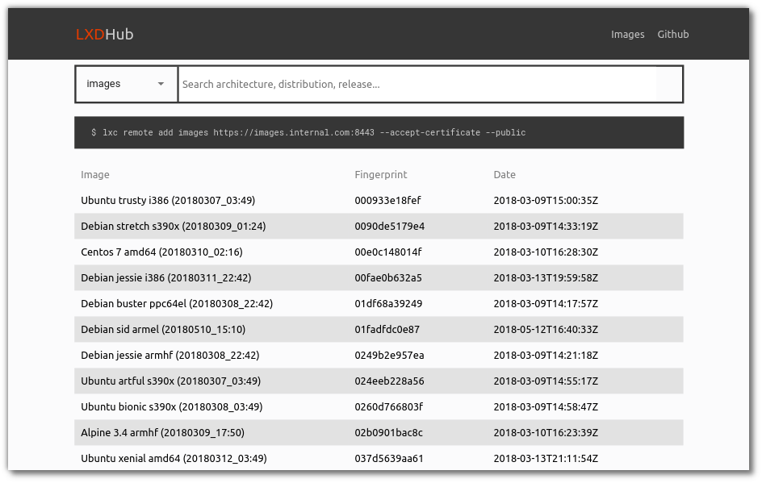
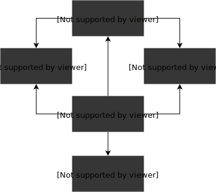

<h1 align="center">
  
</h1>

<h4 align="center">Display, search and copy <a href="https://linuxcontainers.org/lxd/" target="blank">LXC</a> images using a web interface. </h4>

 <p align="center">
  <a href="https://gitter.im/Roche/lxdhub?utm_source=badge&utm_medium=badge&utm_campaign=pr-badge&utm_content=body_badge"></a>
  <a href="https://circleci.com/gh/Roche/lxdhub"></a>
 </p>

<p align="center">
  
</p>

# Purpose

**LXDHub** is a management system for [linux containers (LXC)](https://linuxcontainers.org/). With LXDHub you can visualize **LXC images** of multiple (private & public) remotes. One of the key features of LXDHub is to **clone LXC images** from one remote to another. Therefor you can *mirror* public remotes to your private remote.

# Packages

Under the hood, LXDHub is split in five packages. The following graph visualizes the dependencies of each package.



<table>
  <tr>
    <th>Name</th>
    <th>Version</th>
    <th>Description</th>
  </tr>
  <tr>
    <td><a href="https://github.com/Roche/lxdhub/tree/master/packages/web">@lxdhub/web</a></td>
    <td><a href="https://www.npmjs.com/package/@lxdhub/api"></a></td>
    <td>The LXDHub webinterface</td>
  </tr>
  <tr>
    <td><a href="https://github.com/Roche/lxdhub/tree/master/packages/api">@lxdhub/api</a></td>
    <td><a href="https://www.npmjs.com/package/@lxdhub/api"></a></td>
    <td>The REST API for the LXDHub webinterface</td>
  </tr>
  <tr>
    <td><a href="https://github.com/Roche/lxdhub/tree/master/packages/dbsync">@lxdhub/dbsync</a></td>
    <td><a href="https://www.npmjs.com/package/@lxdhub/dbsync"></a></td>
    <td>The script to synchronize multiple LXD remotes with the LXDHub database</td>
  </tr>
  <tr>
    <td><a href="https://github.com/Roche/lxdhub/tree/master/packages/db">@lxdhub/db</a></td>
    <td><a href="https://www.npmjs.com/package/@lxdhub/db"></a></td>
    <td>The package, which provides database functions for the @lxdhub/api and @lxdhub/dbsync packages</td>
  </tr>
  <tr>
    <td><a href="https://github.com/Roche/lxdhub/tree/master/packages/common">@lxdhub/common</a></td>
    <td><a href="https://www.npmjs.com/package/@lxdhub/common"></a></td>
    <td>The package, which provides common functions for all LXDHub-packages.</td>
  </tr>
</table>

The packages `@lxdhub/db` and `@lxdhub/common` are solely libraries, which can not be run seperatly. Whereas the packages `@lxdhub/web`, `@lxdhub/api` and `@lxdhub/dbsync` can be run seperatly via [Docker](https://www.docker.com/) or [NodeJS](https://nodejs.org/en/).

# Installation

## Prerequisites

- [git >= 2.x.x](https://git-scm.com/)
- [docker >=18.02.0-ce](https://www.docker.com/)
- [docker-compose >=1.19.0](https://docs.docker.com/compose/install/#install-compose)

## Generate LXC Certificate

Before you can start the application, you need to add your LXC certificates.
More information on [generate-lxc-certificates.md](docs/generate-lxc-certificates.md)

## Install

Run the following commands in your terminal prompt.

```bash

# Clone the repository locally
git clone git@github.com:Roche/lxdhub.git lxdhub
cd lxdhub

mv lxdhub.yml.template lxdhub.yml
# Edit the configuration template
vi lxdhub.yml

# Build the containers
docker-compose build
# Run the containers (api, dbsync and db)
docker-compose up

# Open localhost:3000/api/v1/doc

```

# Tests

## Prerequisites

- [NodeJS >= v9.x.x](https://nodejs.org/en/blog/release/v9.0.0/)
- [LXD >= 2.x.x](https://linuxcontainers.org/lxd/)

## Unit / Integration Tests

Run the automated test cases with NodeJS.

```bash

docker build -t $USER/lxdhub .
docker run -it brunnel6/lxdhub test
docker run -it brunnel6/lxdhub lint

```

## Environment for Manual Testing

### LXC

Run the command `./bin/setup-local-test-remote.sh` which uses the port `8443`
for your local LXC REST API. The default password for your local remote is `unsecret`.

### LXDHub API

The LXDHub API offers a test environment, which can be tested manually.
To run the tests exectue the following commands in your terminal prompt.

```bash

# Install the dependencies (optional)
npm install
./bin/start-lxdhub-api-test-env.sh

```

The data will no be loaded from your local SQLite database. The model data inside the test environment,
 are defined inside the `src/api/test/fixtures/*.json` files.

# Related

- [@lxdhub/web](packages/web/README.md): The LXDHub webinterface
- [@lxdhub/api](packages/api/README.md): The REST API for the LXDHub webinterface
- [@lxdhub/dbsync](packages/dbsync/README.md): The script to synchronize multiple LXD remotes with the LXDHub database
- [@lxdhub/db](packages/db/README.md): The package, which provides database functions for the `@lxdhub/api` and `@lxdhub/dbsync` packages
- [@lxdhub/common](packages/common/README.md): The package, which provides common functions for all LXDHub-packages
- [CONTRIBUTING.md](CONTRIBUTING.md): The contributing guidelines
- [COPYRIGHT](COPYRIGHT): Copyright informations
- [publish.md](docs/publish.md): Documentation on how LXDHub is being published
- [LXC](https://linuxcontainers.org/): The underlying technology behind LXDHub

# People

- [Livio Brunner](https://github.com/BrunnerLivio) - Author
- [Eric Keller](https://github.com/erickellerek1) - Idea
