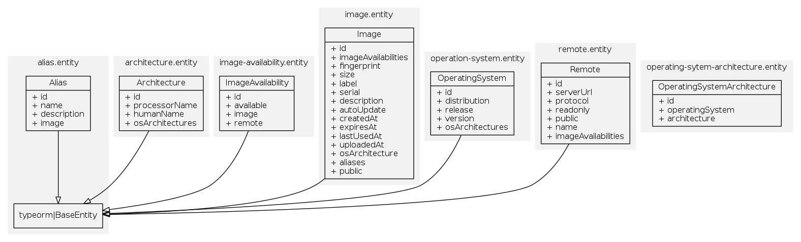

<h2 align="center">
    
</h2>

 <p align="center">Display, search and copy <a href="https://linuxcontainers.org/lxd/" target="blank">LXD</a> images using a web interface. </p>

 <p align="center">
  <a href="https://gitter.im/Roche/lxdhub?utm_source=badge&utm_medium=badge&utm_campaign=pr-badge&utm_content=body_badge"></a>
  
  <a href="https://www.npmjs.com/package/@lxdhub/db"></a>
  <a href="https://www.npmjs.com/package/@lxdhub/db">
    
  </a>
 </p>

# Installation

To install this package, run

```bash

npm i -s @lxdhub/db

```

# Scheme


